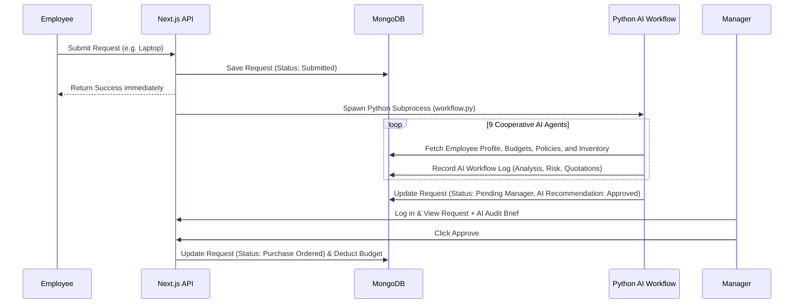

# Architecture Document - Procurement Workflow Platform

This document describes the stack, data model, and high-level design of the Procurement Workflow Platform.

---

## Technical Stack

1. **Frontend / API Layer**:
   - **Next.js (React / TypeScript)**: Standard modern app router structure. The user interface is located in [page.tsx](file:///c:/GDG/src/app/dashboard/page.tsx).
   - **CSS Modules**: Styled using [dashboard.module.css](file:///c:/GDG/src/app/dashboard/dashboard.module.css).
2. **Database**:
   - **MongoDB**: Used to store persistent state (users, assets, budgets, policies, logs, approvals, POs).
3. **Backend / AI Processing Loop**:
   - **Python (3.13)**: Executes the background multi-agent AI verification loop in [workflow.py](file:///c:/GDG/agents/workflow.py).
   - **OpenAI (GPT-4o-mini)**: Powers the semantic analysis, comparison table formatting, policy validation, and risk scoring.
   - **Pyrefly**: Fast static type checker/linter used for verifying python code type safety and imports.

---

## Data Models (MongoDB Schemas)

1. **User**: Represents corporate employees and managers.
   - Fields: `employeeId`, `name`, `email`, `role` (Employee/Manager/Admin), `designation`, `department`, `managerId`, `avatar`.
2. **Asset**: Track assigned hardware and stock.
   - Fields: `assetId`, `assetName`, `category` (Laptop/Monitor/Furniture/etc.), `purchaseDate`, `condition`, `status` (Assigned/Available).
3. **Vendor**: Verified external suppliers.
   - Fields: `vendorName`, `rating`, `averageDeliveryDays`, `approved` (boolean).
4. **VendorQuotation**: Bids/Prices for specific hardware.
   - Fields: `vendorId`, `itemName`, `price` (in ₹), `currency` (INR), `deliveryDays`, `warranty`.
5. **DepartmentBudget**: Yearly budget allocations.
   - Fields: `department`, `fiscalYear`, `allocatedBudget`, `usedBudget`, `remainingBudget`.
6. **ProcurementPolicy**: Rules for each category of procurement.
   - Fields: `policyName`, `category`, `description`, `minRole`, `maxBudget`, `requiresQuotation`, `allowedVendors`.
7. **AIWorkflowLog**: Transparency logging for AI agent pipeline runs.
   - Fields: `requestId`, `agentName`, `action`, `status` (Completed/Failed), `confidence` (%), `reasoning` (markdown), `evidence` (raw JSON).
8. **ManagerApproval**: Action log of manager approvals/clarifications.
   - Fields: `requestId`, `managerId`, `decision` (Approved/Rejected), `comments`.

---

## High-Level Design

The flow follows an asynchronous event-driven model:

